# 星屑オーケストラ 字コンテ
> イラストに僕がわかりやすいように適宜状況の名前付けてますが気にしないでください

## 目次

ちょっと長くなっちゃったので文書で残します！！！
動画構成案は雑に破綻がないか書いてるだけなので、程々に見ていただければ。こんな構成で行くとは思います。


- [動画構成案](#anc3)
- [イラスト一覧](#anc2)
- [ストーリー概要](#anc6)
- [歌詞](#anc1)
- [スケジュールとか](#anc4)
- [補足事項](#anc5)

<div id="anc3"></div>
## 動画構成案

#### 【0サビ】0:00

> 【0:00】 小さな星屑が奏でるオーケストラ

- 開始サビで一気に引きこませる。動画は最初の15秒でそれ以降をちゃんと見るかが決まる。
- 可能ならフラッシュバック的にいろんなイラストを使用して目を引く（？）

> 【0:06】 星に歌おう 名も無い僕の物語を

- 最後の[幸せそうなミク](#illust_11)、もしくは[マイクを前に決意を固めている感じ](#illust_8)を全体が写しきらない程度に使って、これから`名も無い僕の物語`が始まり、このシーンで終わることを暗示っぽくしようと思います。

#### 【イントロ】0:12
- 星空背景で色々動かします。
- 前半はクレジット表示

```
Music:          ハヤブサ(@hayabusa_falco)
Illust:         rik(@rik_kir_888)
JacketIllust:   桜木蓮(@sakuragi_ren)
Movie:          まつらい(@matsurai25)
```

- 後半はロゴのアニメーション
- ライトリークなどでふわっと次のシーンへ移行

#### 【1A】0:21
> 【0:21】 星空に煌く箒星に 無邪気に笑う君を重ねた

- セピア調、周りを白でぼかして思い出してる感じを演出
- [「君」が上京する日](#illust_4)の絵の目より下だけ等を使って、「君」のイメージを出す
- *(他の作業と要相談)使えそうであれば__箒星のエフェクトアニメ__を、星空バックで使うと綺麗になりそう。*

> 【0:32】 そんな君をずっと見ていた 僕は名も無い星屑かな

- [屋上で星を見る](#illust_1)を使用。
- はじめ16拍は引き、後ろ16拍はアップで
    - (涙が落ちる感じで次のシーンとフェード)

#### 【1B】0:42
> 【0:42】 あの日語った夢も 交わした約束も 僕には眩しすぎるけど

- ここでは[回想の絵](#illust_2)を使わない > **曲の一番終盤で、さわやかな雰囲気で終わらせるのにつかいたい**
- かわりに、黒文字白背景の3D空間で補います。
    - (水滴が落ちたところを中心に素早くカメラ回転)
    - (タイポグラフィで文字組みに迫力を)
- 曲に合わせて、リズムに合わせてテンポよく動かす

> 【0:52】 流星の夜に願い叶うなら 君に伝えよう 天の川越えて

- [星を見る](#illust_5)と[屋上、星の下](#illust_18)の絵を使用
- *(他の作業と要相談)使えそうであれば、目の中で__箒星のエフェクトアニメ__を使うと綺麗になりそう。*
- 前半16拍は落ち着き目に、後半16拍は盛り上がり目に
- ライトリークでサビへ画面切り替え

#### 【1サビ】1:03
> 【1:03】 小さな星屑が奏でるオーケストラ 僕の夢を旋律に乗せて

- [蓮さん一枚絵](#illust_ren)を使用
- [ナキムシヒーロー](http://www.nicovideo.jp/watch/sm25460444)的な感じで、キャラの左右に歌詞を出してカメラを動かします
- 基本アドリブ

> 【1:13】 例えばもし僕がいなくなっても ただ君が忘れないように

- キャラは出しつつ、3DCGで注射器やら医療的なイメージをつけます
- ここで「病気でもう長くない」ことを分からせたい

> 【1:24】 星空に奏でよう 名も無い僕が生きた証

- 引きの絵の上に白文字
- 上へパンで次へ

#### 【間奏】1:29

- 星空背景にギターの波形

#### 【2A】1:40
> 【1:40】 粉雪とネオンが街を包む 旅立つ君に何も言えずに
> 冬の空に誰より光る 君のようになれたらいいのに

- [「君」が上京する日](#illust_4)をアップと引きで
- ライトリークとかで次へ

#### 【2B】2:00
> 【2:00】 あの日僕は知った 舞台の裏側で君が一人泣いてたこと

- [君のステージ](#illust_12)、[君の演奏を見に来たミク](#illust_7)、[泣いてる君を知ってしまった](#illust_6)を使用

> 【2:10】 流星の夜に願い叶うなら 涙拭おう 天の川超えて

- [星を見る](#illust_5)と[屋上、星の下](#illust_18)を使用、1B後半と同じ感じ
- 差をつけるなら、差分絵(片目に涙とか)があると良いのかも(未定)

#### 【2サビ】2:21
> 【2:21】 小さな星屑が奏でるオーケストラ 僕の夢を五線譜に詰めて

- 1サビを少し変える程度

> 【2:31】 このままもし僕がいなくなっても ただ君が悲しまないように

- 1サビを少し変える程度

> 【2:41】 涙が枯れるくらい笑わせるんだ 僕の歌で

- [マイクを前に決意を固めている感じ](#illust_8)を使用

#### 【ソロ】2:52

- 3DCGで補います
    - 白基調で病院のメーターと波形を使った感じになるかなという感じです。
    - 謎空間系、ピアノのmidiと連携して動かしたりしたい。
    - 飽きさせない程度にアドリブ。

#### 【C】3:13
> 【3:13】 白い服の指揮者が誘う 僕を物語の最終楽章に

- [医者](#illust_16)を写してから、[告げられる](#illust_14)、[モノクロアップ](#illust_15)へ

> 【3:23】 最後に伝えよう もう一度君に

- 前シーンの[モノクロアップ](#illust_15)から[マイクを前に決意を固めている感じ](#illust_8)を使用。クロスフェードかライトリークで移行。
- 懐中時計の3Dモデルを作り、時間が進んでいく感じを演出、0時になったら展開。
- 全てモノクロ。

> 【3:31】 星明かりが照らす 夢見た舞台で

- 懐中時計から展開、いろんなものがフラッシュバックする。
- ここのシーンをすごくカラフルに。


#### 【小サビ】 3:36
> 【3:36】 小さな星屑が奏でるオーケストラ

- `小さな`:黒背景に白文字（タイトルロゴと同じようなフォント感）
- `星屑が〜`:展開するけど、背景は[マイクを前に決意を固めている感じ](#illust_8)にブラー

> 【3:42】 ただ君に笑って欲しいから

- `ただ君に`:[「君」が上京する日](#illust_4)を目の下ぐらいで
- `笑って欲しいから`:[マイクを前に決意を固めている感じ](#illust_8)のブラーを切る、できれば僕へのアップ

> 【3:46】 ごめんねもう僕はいなくなるけど

- `ごめんねもう僕はいなくなるけど`:24拍間をもたせます
- 残りの8拍で[君が現れる](#illust_9)、[驚くミクのアップ](#illust_10)、[客席からステージにかけてく君](#illust_13)

> 【3:54】 奏でよう最終楽章を

- 黒背景(もしくは星空かも)に白文字

<div id="anc_lastlive"></div>
#### 【大サビ】 3:57
> 【3:57】 旅立つ星屑が奏でるオーケストラ 僕の夢は今ここで叶う

- [ラストライブでの共演](#illust_17)を使用
- ラスサビなのでエフェクトもりもりで
- [キミスペクトル](http://www.nicovideo.jp/watch/sm25250566)の入りのように、カメラがグイっと引いてシーンを作るイメージ
- `僕の夢は`で、制服をちょっとだけ写すかも

> 【4:07】 例えばもし僕が生まれ変わっても また君の傍にいれるように

- 僕のアップと君のアップ

> 【4:17】 星空に奏でよう この光が消える前に

- ギターに合わせて1拍ずつ今までの3DCGを含む色んなシーンを繋ぎます。
- できれば医療／余命なイメージをもたせたい

> 【4:23】 星より眩しい君の 笑顔が僕の生きた証

- [君の笑顔](#illust_19) → [幸せそうなミク](#illust_11)という感じで見せたい

#### 【アウトロ】 4:28

- [ムゲンノツバサ](http://www.nicovideo.jp/watch/sm27554388)アウトロと同じように、ここのギターのチョーキングに合わせて一回話を落とします。
- もう一度クレジットを表示、
- 巻き戻し表現とか使って、一気に捲し上げるイメージです
- 基本的にギターの波形で通す、ここは六角形。(重要)
- 最後の、ベルが入ってくる`4:48`から[回想、一緒に練習をしたこと(ミク)](#illust_2)、及び[回想、一緒に練習をしたこと(君)](#illust_3)を使用、最後に【0サビ】と同じ構図でちょっとだけ幸せそうな様子をフィルムっぽく移して終わるかも。
- ライトリークで柔らかく明転して、タイトルロゴで終わり。


<div id="anc2"></div>
## イラスト一覧

#### 一覧
- 00: [蓮さん一枚絵](#illust_ren)
- 01: [屋上で星を見る](#illust_1)
- 02: [回想、一緒に練習をしたこと(ミク)](#illust_2)
- 03: [回想、一緒に練習をしたこと(君)](#illust_3)
- 04: [「君」が上京する日](#illust_4)
- 05: [星を見る](#illust_5)
- 06: [泣いてる君を知ってしまった](#illust_6)
- 07: [君の演奏を見に来たミク](#illust_7)
- 08: [マイクを前に決意を固めている感じ](#illust_8)
- 09: [君が現れる](#illust_9)
- 10: [驚くミクのアップ](#illust_10)
- 11: [幸せそうなミク](#illust_11)
- 12: [君のステージ](#illust_12)
- 13: [客席からステージにかけてく君](#illust_13)
- 14: [告げられる](#illust_14)
- 15: [モノクロアップ](#illust_15)
- 16: [医者](#illust_16)
- 17: [ラストライブでの共演](#illust_17)
- 18: [屋上、星の下](#illust_18)
- 19: [君の笑顔](#illust_19)

<div id="illust_ren"></div>
##### 00: 蓮さん一枚絵
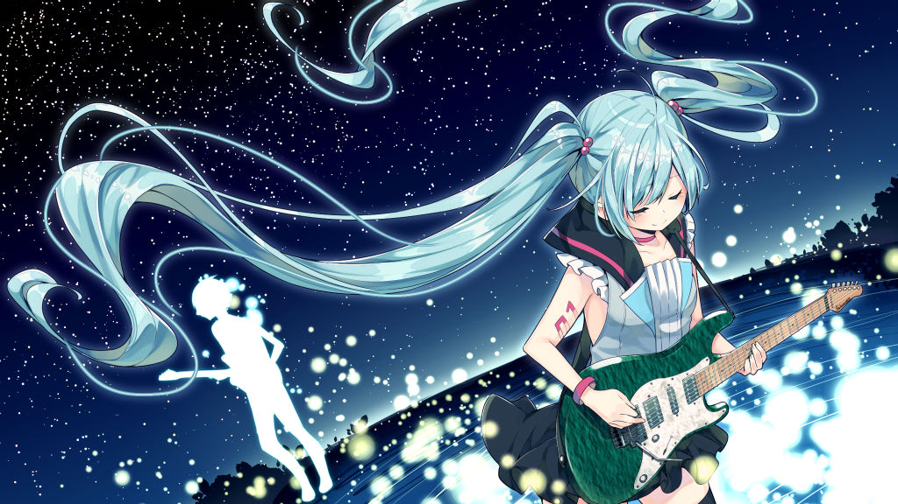

<div id="illust_1"></div>
##### 01: 屋上で星を見る
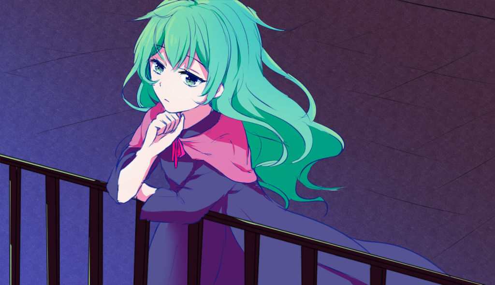

<div id="illust_2"></div>
##### 02: 回想、一緒に練習をしたこと(ミク)
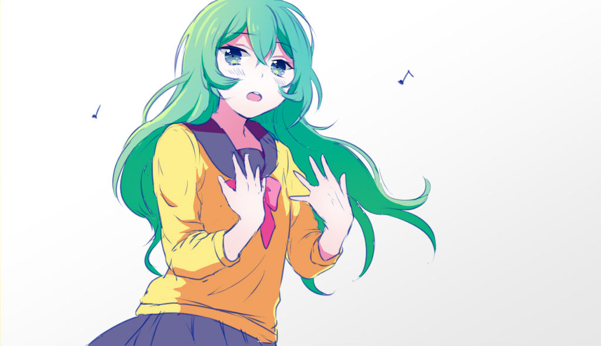

<div id="illust_3"></div>
##### 03: 回想、一緒に練習をしたこと(君)


<div id="illust_4"></div>
##### 04: 「君」が上京する日
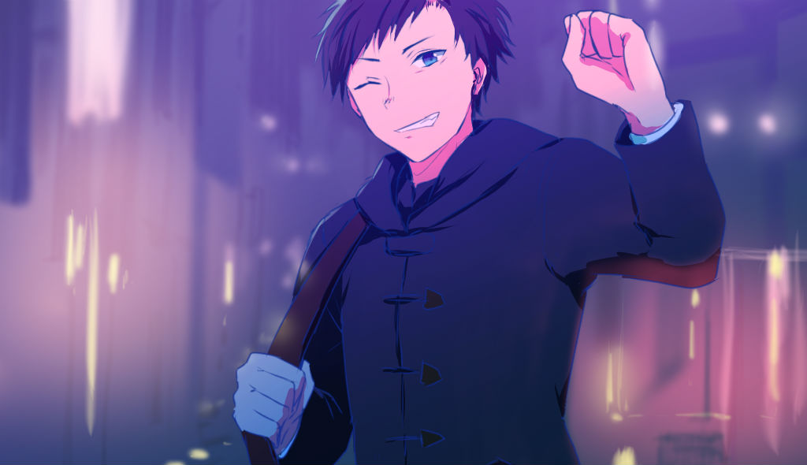

<div id="illust_5"></div>
##### 05: 星を見る
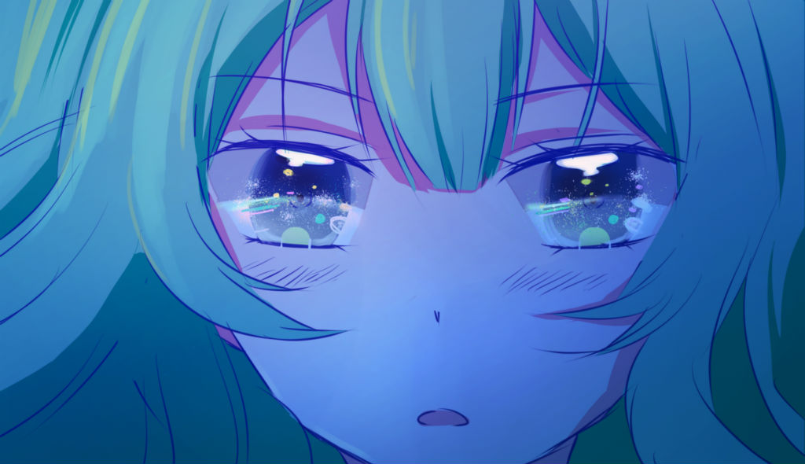

<div id="illust_6"></div>
##### 06: 泣いてる君を知ってしまった
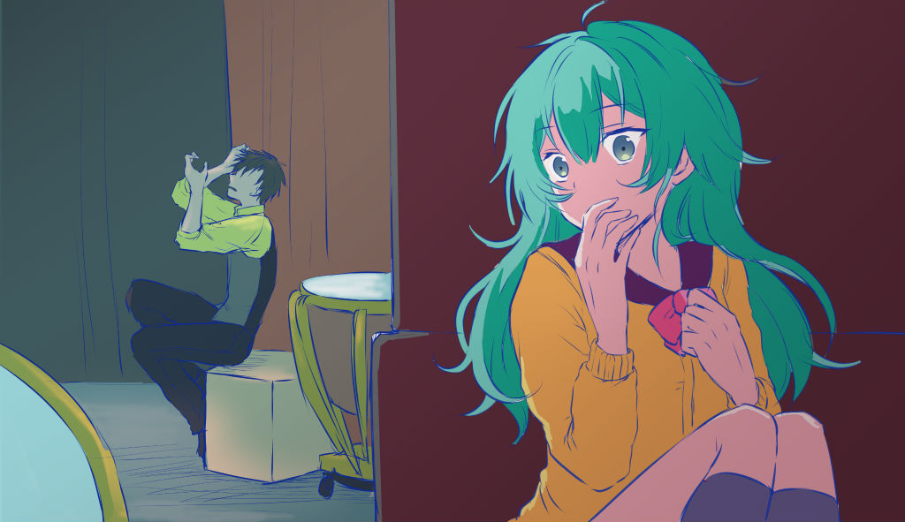

<div id="illust_7"></div>
##### 07: 君の演奏を見に来たミク
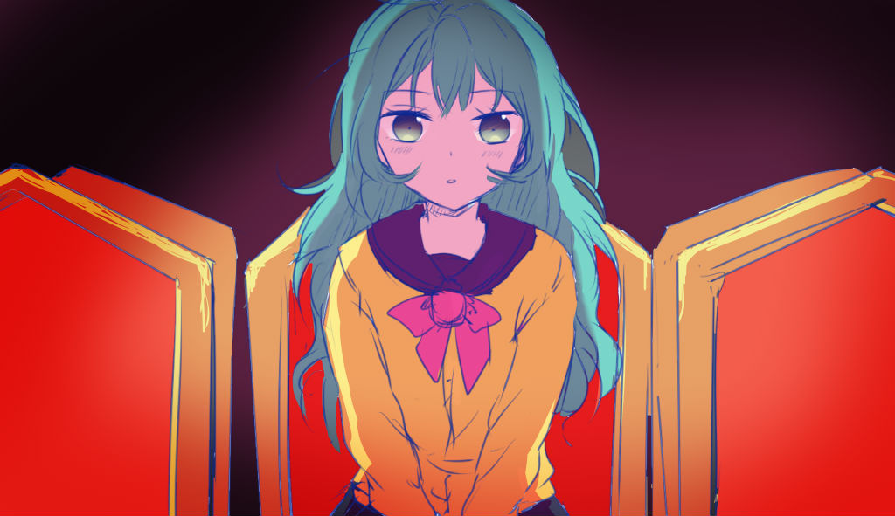

<div id="illust_8"></div>
##### 08: マイクを前に決意を固めている感じ
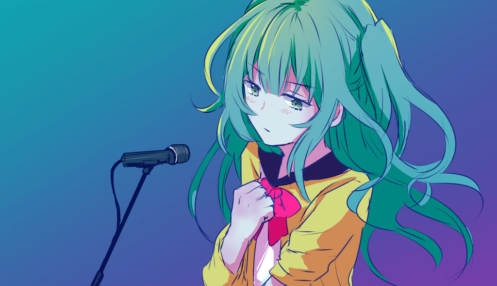

<div id="illust_9"></div>
##### 09: 君が現れる
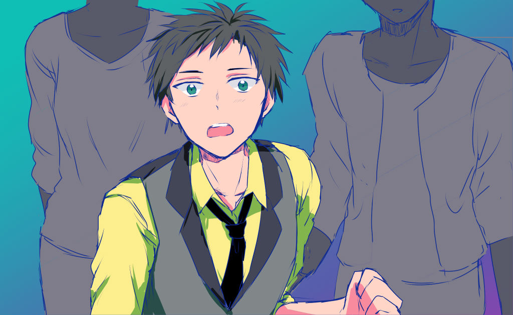

<div id="illust_10"></div>
##### 10: 驚くミクのアップ
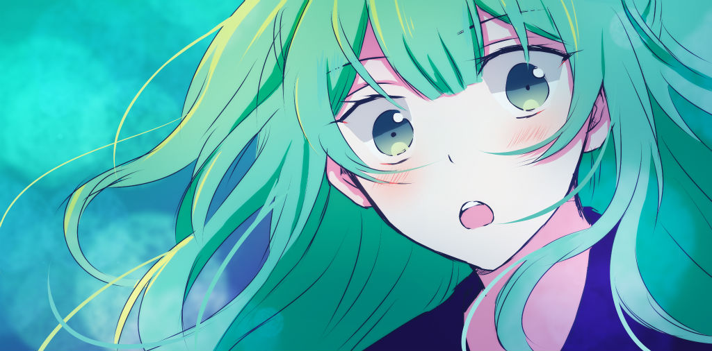

<div id="illust_11"></div>
##### 11: 幸せそうなミク
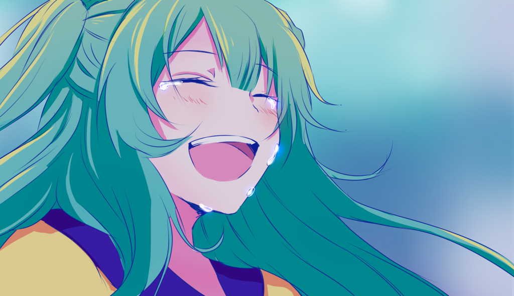

<div id="illust_12"></div>
##### 12: 君のステージ
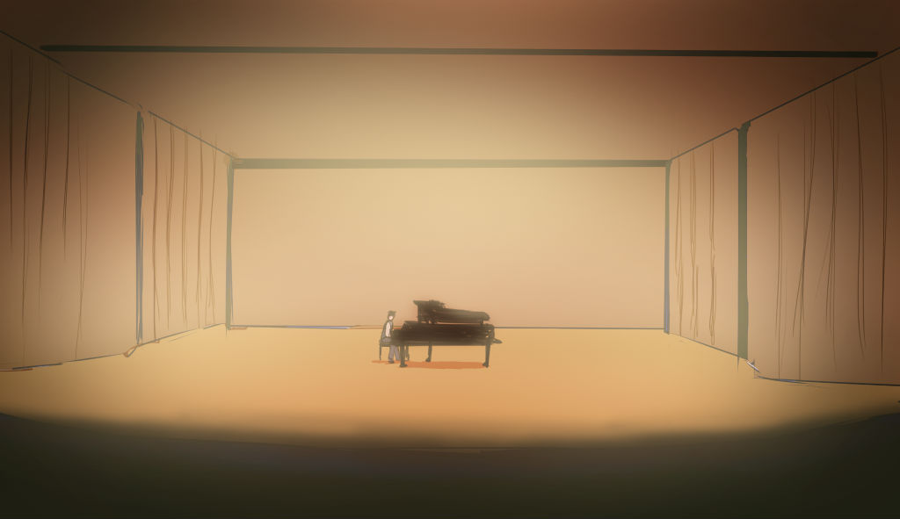

<div id="illust_13"></div>
##### 13: 客席からステージにかけてく君
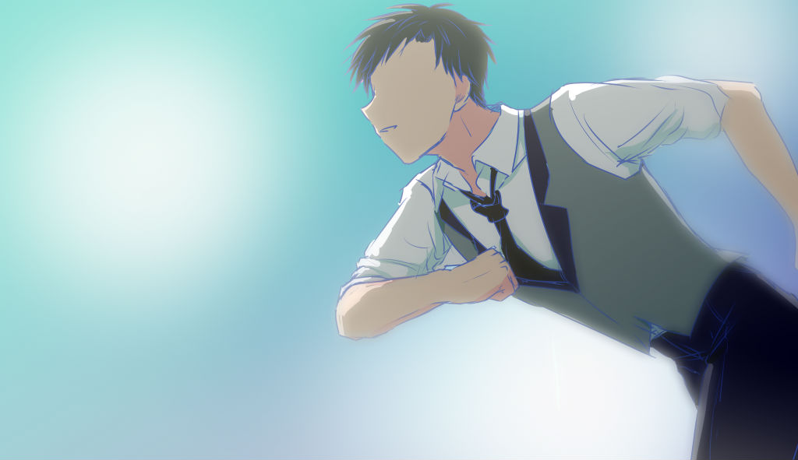

<div id="illust_14"></div>
##### 14: 告げられる
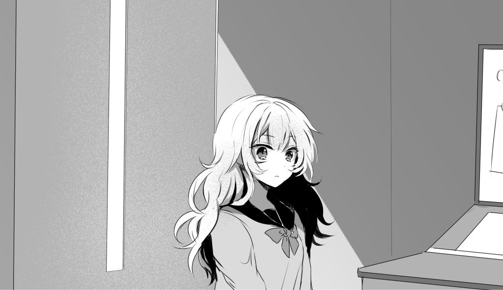

<div id="illust_15"></div>
##### 15: モノクロアップ
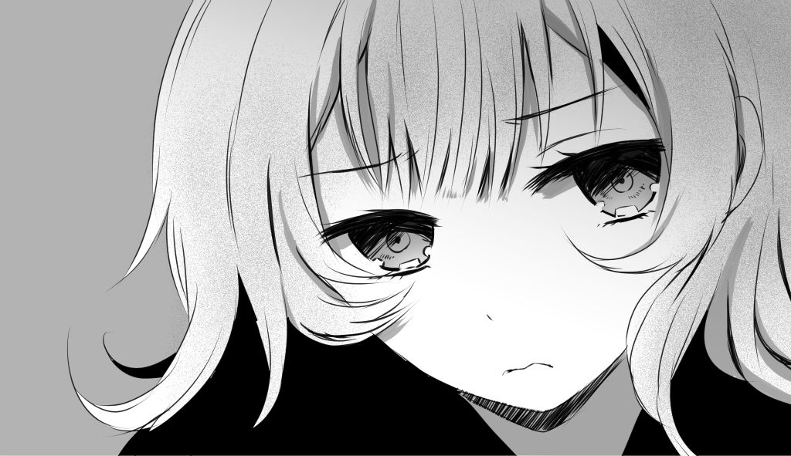

<div id="illust_16"></div>
##### 16: 医者
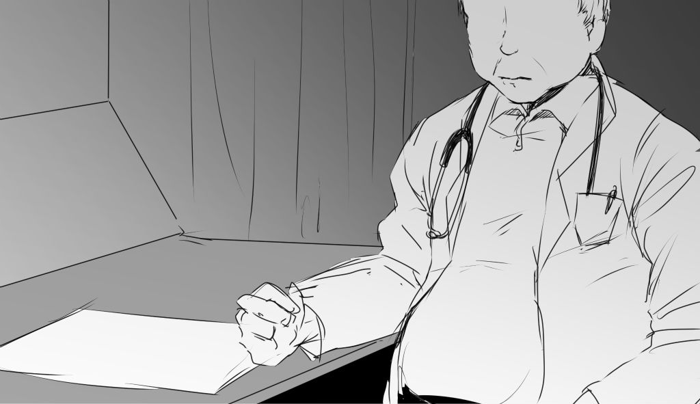

<div id="illust_17"></div>
##### 17: ラストライブでの共演


<div id="illust_18"></div>
##### 18: 屋上、星の下
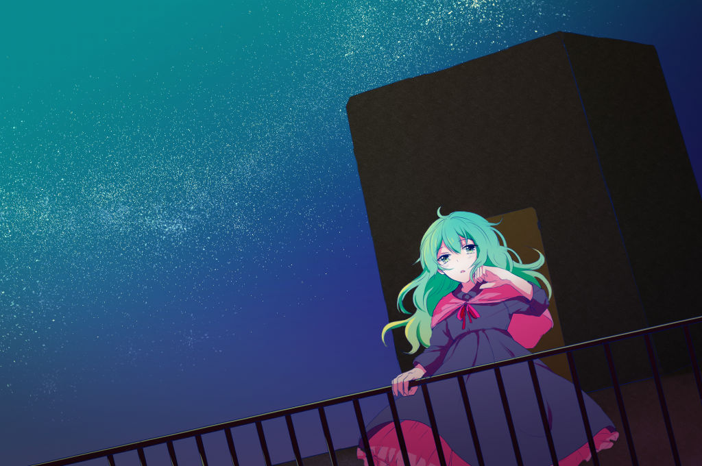

<div id="illust_19"></div>
##### 19: 君の笑顔
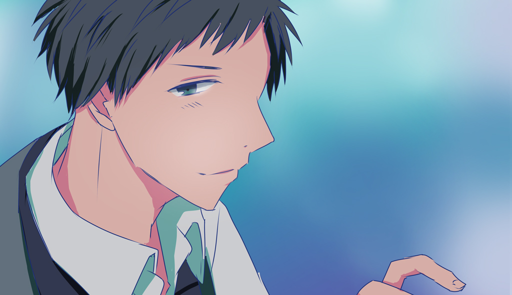


<div id="anc6"></div>
## ストーリー概要

```
お互いミュージシャンを目指してた幼馴染２人
「君」はプロのピアニストになって
自分（ミク）は小さなライブハウスで売れないバンドマンをしてる。
君に憧れつつも自分が情けなくて長いこと連絡を取ってなかった。

ミクはある日医者に病気でもう長くないと言われる。
それでもそのことを隠して、応援してくれるファンや
どこかで見てるかも知れない君に笑って欲しいから最後まで歌い続けます。

そして星空の下、野外ステージでラストライブを行います。
そのライブのことも知らせていなかったのに、
突然ステージの上に現れた「君」は病気のことも全て知っていました。
そして憧れの君と共演することになり、僕の夢は叶いました。終わり。

```

<div id="anc1"></div>
## 歌詞
```

【0サビ】0:00
    小さな星屑が奏でるオーケストラ
    星に歌おう 名も無い僕の物語を

【1A】0:21
    星空に煌く箒星に
    無邪気に笑う君を重ねた
    そんな君をずっと見ていた
    僕は名も無い星屑かな

【1B】0:42
    あの日語った夢も 交わした約束も
    僕には眩しすぎるけど
    流星の夜に願い叶うなら
    君に伝えよう 天の川越えて

【1サビ】1:03
    小さな星屑が奏でるオーケストラ
    僕の夢を旋律に乗せて
    例えばもし僕がいなくなっても
    ただ君が忘れないように
    星空に奏でよう
    名も無い僕が生きた証

【2A】1:40
    粉雪とネオンが街を包む
    旅立つ君に何も言えずに
    冬の空に誰より光る
    君のようになれたらいいのに

【2B】2:00
    あの日僕は知った
    舞台の裏側で君が一人泣いてたこと
    流星の夜に願い叶うなら
    涙拭おう 天の川超えて

【2サビ】2:21
    小さな星屑が奏でるオーケストラ
    僕の夢を五線譜に詰めて
    このままもし僕がいなくなっても
    ただ君が悲しまないように
    涙が枯れるくらい笑わせるんだ 僕の歌で

【C】3:13
    白い服の指揮者が誘う
    僕を物語の最終楽章に
    最後に伝えよう もう一度君に
    星明かりが照らす 夢見た舞台で

【小サビ】 3:37
    小さな星屑が奏でるオーケストラ
    ただ君に笑って欲しいから
    ごめんねもう僕はいなくなるけど
    奏でよう最終楽章を

【大サビ】 3:57
    旅立つ星屑が奏でるオーケストラ
    僕の夢は今ここで叶う
    例えばもし僕が生まれ変わっても
    また君の傍にいれるように
    星空に奏でよう この光が消える前に
    星より眩しい君の笑顔が僕の生きた証


```
